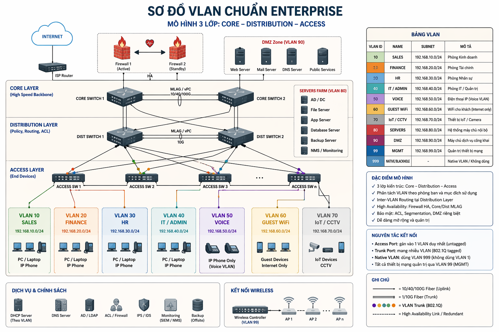

Tôi sẽ dạy bạn về **VLAN (Virtual Local Area Network)** theo cách mà **một Network Technician thực thụ cần biết**, từ **cơ bản → triển khai thực tế → troubleshooting**. Đây gần như là toàn bộ kiến thức cốt lõi mà kỹ thuật mạng cần nắm.

---

# 1. VLAN là gì?

**VLAN (Virtual Local Area Network)** là kỹ thuật chia **một mạng vật lý thành nhiều mạng logic riêng biệt**.

Nói đơn giản:

* 1 switch vật lý
* nhưng tạo ra nhiều **mạng LAN độc lập**

Các thiết bị trong VLAN này **không thể giao tiếp trực tiếp** với VLAN khác.

### Ví dụ thực tế

Một công ty có:

| Phòng ban | VLAN    |
| --------- | ------- |
| Kế toán   | VLAN 10 |
| IT        | VLAN 20 |
| Marketing | VLAN 30 |

Mặc dù **tất cả cắm chung 1 switch**, nhưng mạng vẫn **tách biệt hoàn toàn**.

---

# 2. Tại sao cần VLAN?

Có 4 lý do chính:

### 1️⃣ Security (Bảo mật)

Máy trong VLAN khác **không sniff được traffic** của nhau.

Ví dụ:

* PC kế toán không thể truy cập PC IT.

---

### 2️⃣ Broadcast Control

Mạng LAN có **broadcast traffic**.

Nếu không có VLAN:

* broadcast lan toàn switch

Nếu có VLAN:

* broadcast chỉ nằm **trong VLAN đó**

=> giảm **network congestion**

---

### 3️⃣ Network Segmentation

Chia mạng theo:

* phòng ban
* hệ thống
* server
* IoT

---

### 4️⃣ Easier Management

Thay vì:

* kéo dây mạng mới

Chỉ cần:

* gán **VLAN ID**

---

# 3. VLAN hoạt động như thế nào

Mỗi VLAN có **VLAN ID**

Theo chuẩn **IEEE 802.1Q**

| VLAN ID   | Range        |
| --------- | ------------ |
| 1         | default VLAN |
| 2–1001    | normal range |
| 1002–1005 | reserved     |
| 1006–4094 | extended     |

---

# 4. 2 loại Port VLAN

Một Network Technician **phải phân biệt rõ** 2 loại port.

## 1️⃣ Access Port

Access port chỉ thuộc **1 VLAN duy nhất**

Ví dụ:

```
PC -> Switch
```

PC **không hiểu VLAN tag**

Switch sẽ:

* remove VLAN tag trước khi gửi

Ví dụ:

```
interface fa0/1
switchport mode access
switchport access vlan 10
```

---

## 2️⃣ Trunk Port

Trunk port dùng để:

* kết nối **Switch ↔ Switch**
* hoặc **Switch ↔ Router**

Trunk port có thể mang **nhiều VLAN**.

```
Switch A  ---- trunk ---- Switch B
```

VLAN được gắn **tag 802.1Q**

Ví dụ:

```
interface g0/1
switchport mode trunk
switchport trunk allowed vlan 10,20,30
```

---

# 5. VLAN Tagging (802.1Q)

Khi frame đi qua trunk:

Switch sẽ thêm **4 byte tag** vào Ethernet frame.

Tag chứa:

| Field    | Meaning       |
| -------- | ------------- |
| VLAN ID  | VLAN number   |
| Priority | QoS           |
| CFI      | compatibility |

Frame structure:

```
| Dest MAC | Src MAC | VLAN TAG | EtherType | Data |
```

---

# 6. Native VLAN

Trunk có một VLAN đặc biệt gọi là:

**Native VLAN**

Frame thuộc native VLAN:

* **không gắn tag**

Default:

```
VLAN 1
```

Best practice:

```
Không dùng VLAN 1
```

---

# 7. Inter-VLAN Routing

Các VLAN **không nói chuyện trực tiếp với nhau**.

Muốn giao tiếp cần:

**Layer 3 routing**

Có 3 cách:

---

## 1️⃣ Router-on-a-stick

Router + 1 trunk link

```
Router
   |
 trunk
   |
Switch
```

Router config:

```
interface g0/0.10
encapsulation dot1Q 10
ip address 192.168.10.1
```

---

## 2️⃣ Layer 3 Switch

Switch có routing capability.

Ví dụ:

```
ip routing

interface vlan 10
ip address 192.168.10.1

interface vlan 20
ip address 192.168.20.1
```

---

## 3️⃣ Firewall routing

Do firewall handle routing.

---

# 8. VLAN Database

Bạn phải tạo VLAN trước khi dùng.

Cisco example:

```
vlan 10
name ACCOUNTING

vlan 20
name IT
```

Check:

```
show vlan brief
```

---

# 9. VTP (VLAN Trunking Protocol)

VTP dùng để:

* đồng bộ VLAN giữa switch

Phát triển bởi:

Cisco

Mode:

| Mode        | Meaning    |
| ----------- | ---------- |
| Server      | tạo VLAN   |
| Client      | nhận VLAN  |
| Transparent | không sync |

Tuy nhiên **network hiện đại ít dùng VTP**.

---

# 10. VLAN Security Best Practices

Một Network Technician giỏi **không bao giờ bỏ qua security**.

### 1️⃣ Disable unused ports

```
interface range fa0/10-24
shutdown
```

---

### 2️⃣ Không dùng VLAN 1

Move sang VLAN khác.

---

### 3️⃣ Set Native VLAN khác

```
switchport trunk native vlan 999
```

---

### 4️⃣ VLAN hopping protection

Disable:

```
switchport mode access
switchport nonegotiate
```

---

# 11. VLAN Troubleshooting

Đây là phần **quan trọng nhất khi đi làm**.

## 1️⃣ Kiểm tra VLAN tồn tại

```
show vlan brief
```

---

## 2️⃣ Kiểm tra trunk

```
show interfaces trunk
```

---

## 3️⃣ Kiểm tra port VLAN

```
show running-config interface fa0/1
```

---

## 4️⃣ Ping gateway

Ví dụ:

```
ping 192.168.10.1
```

---

## 5️⃣ Kiểm tra MAC table

```
show mac address-table
```

---

# 12. Ví dụ Topology thực tế

```
           Router
             |
           trunk
             |
          Switch
       /     |      \
     PC1    PC2    PC3
    VLAN10 VLAN20 VLAN30
```

IP:

```
VLAN10 -> 192.168.10.0/24
VLAN20 -> 192.168.20.0/24
VLAN30 -> 192.168.30.0/24
```

Gateway:

```
192.168.x.1
```

---

# 13. Những lỗi VLAN phổ biến

| Lỗi                   | Nguyên nhân          |
| --------------------- | -------------------- |
| PC ping không được    | VLAN sai             |
| VLAN không qua switch | trunk chưa allow     |
| mất mạng random       | native VLAN mismatch |
| VLAN không sync       | VTP issue            |

---

# 14. Kiến thức nâng cao Network Technician nên biết

Sau VLAN cơ bản, bạn nên học thêm:

* **Private VLAN**
* **Voice VLAN**
* **Dynamic VLAN (802.1X)**
* **Q-in-Q VLAN**
* **VXLAN**
* **VLAN ACL**

---

# 15. Một Network Technician giỏi VLAN cần hiểu

4 cấp độ hiểu:

### Level 1 — Basic

* VLAN là gì
* Access / Trunk

---

### Level 2 — Configuration

* create VLAN
* trunk config
* inter VLAN routing

---

### Level 3 — Design

* segmentation
* security
* broadcast control

---

### Level 4 — Troubleshooting

* MAC table
* ARP
* trunk mismatch
* STP interaction

---

💡 Nếu bạn muốn, tôi có thể dạy tiếp những thứ **Network Technician thực chiến phải biết nhưng ít tài liệu dạy**, ví dụ:

* **VLAN + STP hoạt động cùng nhau thế nào** (90% người mới không hiểu)
* **VLAN design cho hệ thống 1000–10,000 máy**
* **VLAN troubleshooting trong 5 phút như senior engineer**
* **10 lỗi VLAN mà kỹ sư mạng hay mắc nhất**

Tôi cũng có thể vẽ cho bạn **một sơ đồ VLAN chuẩn enterprise mà các công ty lớn dùng**.



Trong VLAN chỉ có **2 loại port quan trọng nhất** mà một Network Technician phải hiểu rõ:

* **Access Port**
* **Trunk Port**

Tôi sẽ giải thích theo kiểu **dễ hình dung nhất trong thực tế mạng doanh nghiệp**.

---

# 1. Access Port (Port cho thiết bị người dùng)

**Access port** là port dành cho **thiết bị cuối (end device)**.

Ví dụ:

* PC
* Laptop
* Printer
* Camera
* IP phone

Đặc điểm:

* Chỉ thuộc **1 VLAN duy nhất**
* **Không có VLAN tag**
* Thiết bị cắm vào **không biết VLAN là gì**

### Ví dụ đơn giản

```
PC ---- Switch
        (Access Port)
```

PC thuộc:

```
VLAN 10
```

Switch sẽ tự hiểu:

```
mọi traffic từ PC = VLAN 10
```

PC **không cần biết VLAN tồn tại**.

---

### Ví dụ config (Cisco)

```
interface fa0/1
switchport mode access
switchport access vlan 10
```

Ý nghĩa:

```
Port fa0/1 thuộc VLAN 10
```

---

### Ví dụ thực tế

| Thiết bị         | VLAN    |
| ---------------- | ------- |
| PC phòng Sales   | VLAN 10 |
| PC phòng Finance | VLAN 20 |
| PC phòng HR      | VLAN 30 |

Mỗi PC cắm vào **access port riêng**.

---

# 2. Trunk Port (Port cho thiết bị mạng)

**Trunk port** dùng để kết nối **thiết bị mạng với nhau**.

Ví dụ:

* Switch ↔ Switch
* Switch ↔ Router
* Switch ↔ Firewall
* Switch ↔ Wireless Controller

Đặc điểm:

* Mang **nhiều VLAN cùng lúc**
* Frame có **VLAN tag**
* Dùng chuẩn **IEEE 802.1Q**

---

### Ví dụ dễ hiểu

Giả sử có 2 switch.

Switch A có:

* VLAN 10
* VLAN 20
* VLAN 30

Switch B cũng có:

* VLAN 10
* VLAN 20
* VLAN 30

Kết nối:

```
Switch A ===== Switch B
            trunk
```

Trunk sẽ truyền:

```
VLAN 10 traffic
VLAN 20 traffic
VLAN 30 traffic
```

Tất cả đi chung **1 dây mạng**.

---

### Ví dụ config

```
interface g0/1
switchport mode trunk
switchport trunk allowed vlan 10,20,30
```

Ý nghĩa:

```
Port g0/1 cho phép VLAN 10 20 30 đi qua
```

---

# 3. Sự khác nhau giữa Access và Trunk

| Đặc điểm | Access Port  | Trunk Port              |
| -------- | ------------ | ----------------------- |
| VLAN     | 1 VLAN       | nhiều VLAN              |
| VLAN tag | không        | có                      |
| dùng cho | PC, printer  | switch, router          |
| mục đích | kết nối user | kết nối network devices |

---

# 4. Ví dụ topology thực tế

```
          Router
             |
           trunk
             |
        Core Switch
        /        \
     trunk      trunk
      /            \
 Access SW1     Access SW2
   /  |  \        /  |  \
 PC  PC  PC     PC  PC  PC
```

* PC → Access Port
* Switch ↔ Switch → Trunk Port
* Router ↔ Switch → Trunk Port

---

# 5. Cách nhớ cực nhanh (Network Engineer hay dùng)

Quy tắc:

```
User device → Access Port
Network device → Trunk Port
```

---

# 6. Lỗi phổ biến của người mới

### Lỗi 1

PC cắm vào **trunk port**

Kết quả:

```
PC không nhận IP
```

---

### Lỗi 2

Switch nối nhau nhưng port để **access**

Kết quả:

```
VLAN không đi qua switch
```

---

# 7. Một trường hợp đặc biệt

IP Phone thường dùng:

```
Access VLAN + Voice VLAN
```

Ví dụ:

```
switchport access vlan 10
switchport voice vlan 50
```

Traffic:

* PC → VLAN 10
* IP Phone → VLAN 50

---

✅ Tóm lại:

```
Access Port = cho thiết bị người dùng
Trunk Port  = cho thiết bị mạng
```

---

Nếu bạn muốn, tôi có thể giải thích thêm **3 thứ cực quan trọng mà Network Technician phải hiểu về VLAN nhưng 90% người mới không biết**:

1️⃣ **Native VLAN là gì và tại sao gây lỗi mạng rất nguy hiểm**
2️⃣ **VLAN Tagging hoạt động bên trong frame Ethernet thế nào**
3️⃣ **Tại sao VLAN không ping được nhau (Inter-VLAN routing)**

Ba phần này mới là **phần “thực chiến” khi làm việc với VLAN.**
